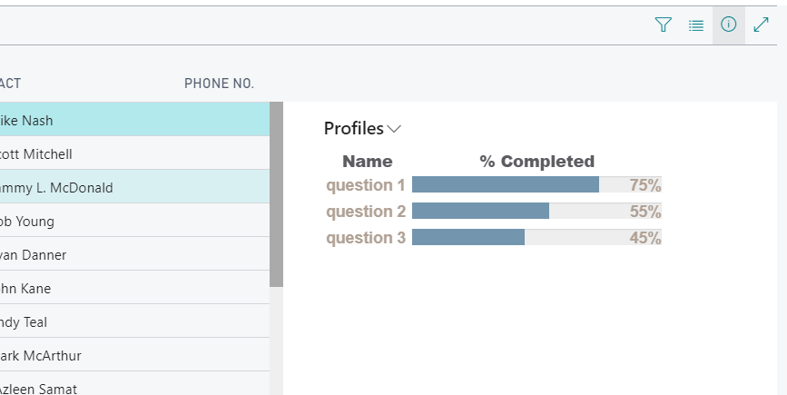

# B365JQueryProgressBar
A progress bar for Dynamics NAV BC365. Compatible with AL and Business Central cloud platforms.

Consumes a json file as a paramater - see structure below. 
Takes 3 fields from the json data:
1. Primary Key - used to create a div and perfrom a callback into NAV
2. Relevant name (anything)
3. Percentage.

How to install.
1. Add to the B365 ControlAddIn folder
2. Add 'usercontrol' to any page, preferably factbox.
3. Create json and provide to the add-in.
4. Enjoy!

JSON

JQuery part originates from kingrayhan @ https://kingrayhan.github.io/LineProgressbar/
